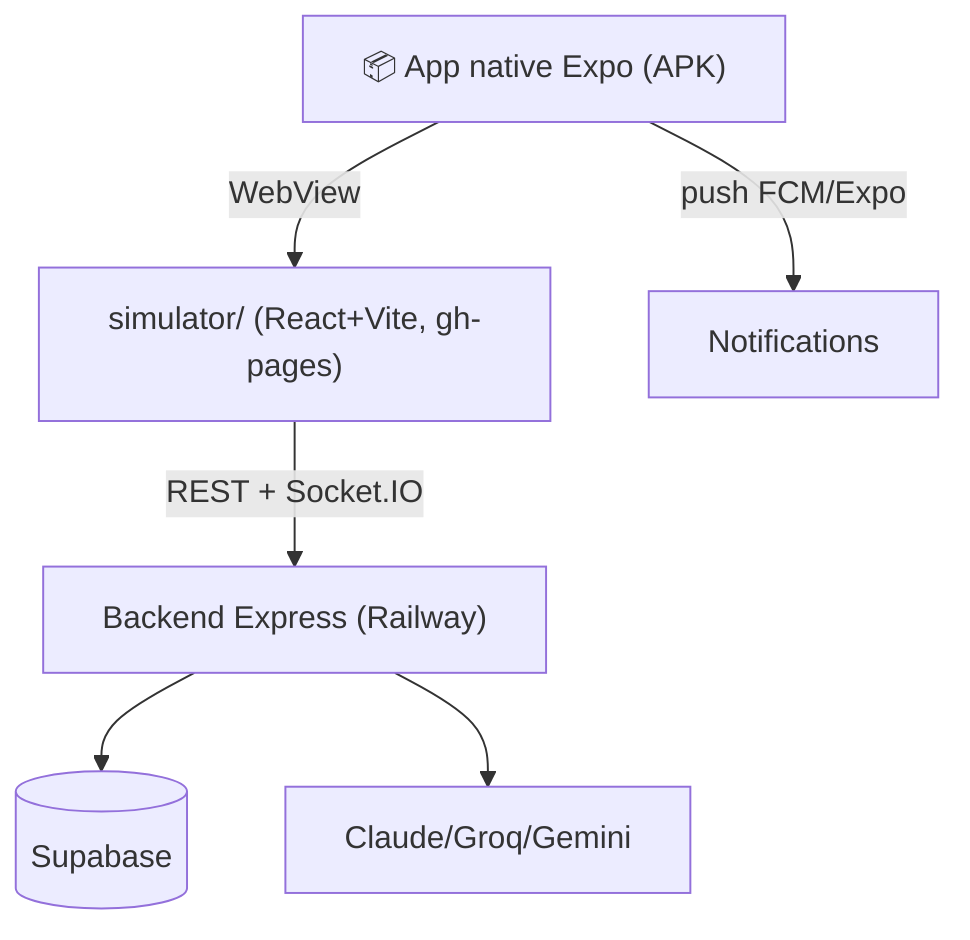

# 📱 App Dzaryx — Vue d'ensemble

Retour : [[🏠 ACCUEIL]] · [[APP/01 - Écrans]] · [[APP/02 - IA & Outils]] · [[APP/03 - Design system]]

> [!abstract] L'app en une phrase
> Le **cerveau** qui fait tourner toute la conciergerie depuis le téléphone : assistant IA (vocal + chat + vision), gestion complète (résas, parc, immo, finances), et des outils uniques (devis instantané, assistant WhatsApp, prévision saison, parrainage…). Le tout connecté au site, **€0** (sauf Railway).

## Comment c'est fait (important)

> [!warning] L'UI réelle = le **simulateur** (React, GitHub Pages) chargé en **WebView** par l'app native
> Quand on édite l'app, on édite `simulator/`, pas des écrans natifs. La coquille Expo apporte : vocal natif, notifications push, overlay. Source de vérité de la nav : `simulator/src/components/Phone.tsx` (`TABS` + `renderScreen`).

## Les onglets (nav)

Barre du bas = **8 essentiels** : ☀️ Aujourd'hui · 🎙️ Voix · 💬 Chat · 📥 Demandes · 🚗 Parc · 💰 CA · 👥 Clients · ⚙️ Config.
Bouton **⋯ Plus** = outils : Chercher · Devis · Réponse · Locations · Immo · Achat · Agenda · Caisse · Avis · Relance · Parrainage · Social · Prévision · Prix · News · Blog · Docs.

> [!tip] Pourquoi un menu "Plus" ?
> ~26 fonctions = trop d'onglets en ligne. On garde l'essentiel en bas, le reste dans une grille (ToolsGrid). Détail : [[APP/01 - Écrans]].

## Multi-acteur

Kouider (vert) et Houari (violet) ont des vues filtrées sur leurs biens. Les outils business/marketing sont **kouiderOnly**. Décision d'ouvrir certains à Houari = en attente.

## Ce qui rend l'app unique à Oran

- **Devis instantané multi-service** → WhatsApp/PDF en secondes
- **Assistant WhatsApp** qui rédige les réponses dans la langue du client
- **Prévision saison diaspora** (été/Aïd) + **prix conseillés**
- **Parrainage** viral + **machine à avis** Google
- **Vocal mains-libres** + **vision** (photo → analyse)
- **€0-proof** : bascule LLM gratuits si Claude meurt
