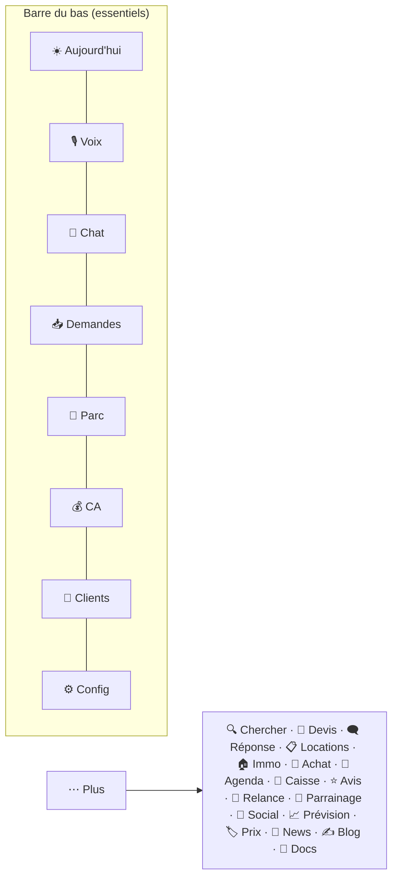

# 📲 App — Tous les écrans (utilisateur + dev)

Retour : [[APP/00 - Vue d'ensemble]] · [[🏠 ACCUEIL]]

> [!info] Mapping nav (source de vérité)
> `Phone.tsx` : `TABS` (liste + `group:'tool'`) et `renderScreen()`. ⚠️ Avant d'éditer un écran, vérifie quel composant est rendu (pièges d'écrans en double passés).

---

## ☀️ Aujourd'hui (Command Center)
Départs / retours du jour, à encaisser, demandes (24h). Le centre de commande du matin. `CommandCenterScreen` ← `/api/insights/today`.

## 🎙️ Voix
Mode vocal mains-libres : orbe IA animé (réactif voix), tap-to-talk, barge-in, STT→Claude/Groq→TTS. `VoiceScreen`.

## 💬 Chat
Façon ChatGPT : bulles (Dzaryx = carte sombre, toi = bulle turquoise), markdown, copier, régénérer, **graphiques**, **création d'annonces + photos jointes**, vision. `TextScreen`.

## 📥 Demandes
Agrège **leads + dossiers + import + résas en attente** du site (`/api/demandes`). Actions : accepter/refuser résa (→ Google Agenda), **avancer les étapes** dossier/import, **ajouter des photos**, **+ Nouveau** (créer dossier/import), relance WhatsApp. `DemandesScreen`.

## 🚗 Parc
Véhicules (dispo toggle, prix Proprio/Client/Marge, occupation, photos, inspection, réserver) + sous-onglets Immo / Vente. `FleetScreen`.

## 💰 CA
Revenus mois/année, split Kouider/Houari, encaissé, **reste à encaisser**, par véhicule. `RevenueScreen`.

## 👥 Clients
Fiche complète : historique résas (véhicule, dates, prix), documents (passeport/permis/contrat), dernière voiture louée, scoring VIP, opérations. `ClientsScreen` (écran de référence design).

## ⚙️ Config
Réglages app/site. `SettingsScreen`.

---

### Outils (⋯ Plus)

## 🔍 Chercher
Recherche globale (client, voiture, dossier, import, bien, lead) → **résultat cliquable** ouvre l'onglet. `/api/search`.

## 🧮 Devis
Compose voiture + logement + extras → total auto → **WhatsApp** (langue client) + **PDF** + **historique**. `DevisScreen` ← `/api/quote/pdf`, `/api/quote/list`.

## 🗨️ Réponse
Colle le message d'un client → Dzaryx rédige la réponse (FR/Darija/EN, ton choisi) → édite → WhatsApp. `/api/whatsapp/draft` (Groq).

## 🧾 Caisse
Entrées/sorties manuelles, totaux du mois **par devise** (DZD/EUR). `/api/cash`.

## ⭐ Avis
Note moyenne, en attente/publiés, publier/masquer/supprimer. `/api/reviews`.

## 🔁 Relance
Clients dormants (pas revenus depuis X mois) → relance WhatsApp 1 tap. `/api/insights/reengage`.

## 🎁 Parrainage
Crée des codes parrain, partage WhatsApp, compteur. Le client entre le code à la réservation → comptage auto. `/api/referrals`.

## 📱 Social
Génère posts TikTok/Insta/FB + hashtags (langue choisie). `/api/social/generate` (Groq).

## 📈 Prévision
Pics de saison diaspora (été/Aïd) + conseils flotte. `/api/insights/forecast`.

## 🏷️ Prix
Prix conseillés par occupation + saison (indicatif). Calcul front (fleet + forecast).

## 📣 News
Campagne newsletter (test + à tous), liste abonnés. `/api/newsletter` → site (Resend).

## ✍️ Blog
Rédaction IA → relire → publier (+ photo d'affiche). `/api/blog`, `/api/blog-generate`.

## 📄 Docs
Documents clients (passeport/permis/contrat), scan OCR.

> [!success] Mode hors-ligne
> Chaque écran garde sa dernière donnée connue (cache localStorage). Sans réseau → affiche quand même + bannière "Hors ligne". Création/IA = besoin réseau.
