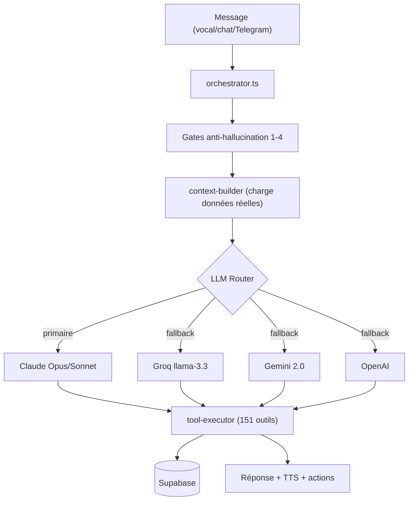
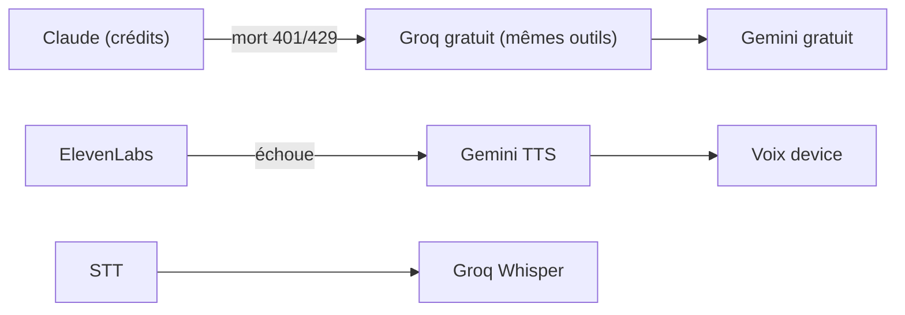

# 🧠 App — Cerveau IA, outils & backend

Retour : [[APP/00 - Vue d'ensemble]] · [[📐 ARCHITECTURE]]

## Le cerveau (orchestrateur)

> [!info] Fichiers critiques (backend)
> - `conversation/orchestrator.ts` — point d'entrée IA + Guards 1-4
> - `orchestrator/anti-hallucination.ts` — Gates 2+3 bloquants (pas de write claim sans outil réel)
> - `integrations/tool-executor.ts` — exécute les outils → Supabase (toujours renvoyer une string)
> - `integrations/llm-router.ts` — cascade de providers
> - `integrations/finance.ts` — `computeBookingFinancials()` (calculs réels)

## Les outils (≈151)

Familles : **réservations** (create/update/delete_booking), **flotte** (add/update/delete_car, maintenance, photos), **immo/vente** (create_property, add_vehicle_for_sale…), **packs** (create_pack, set_pack_status), **clients** (intelligence, notes, arrival patterns), **finance** (revenus, P&L, reçus, vouchers, export Excel), **contrats** (generate_contract, signature), **contenu/marketing** (blog, vidéos TikTok), **agenda** (Google), **avis** (approve/delete/list), **GPS** (distance, frais livraison), **vision** (estimation dégâts, scan ID).

> [!note] Routes API backend (app)
> `/api/demandes` (+update,/create,/photos), `/api/clients` (+/:phone, intelligence, leads, deals), `/api/cash`, `/api/reviews`, `/api/blog` (+/cover), `/api/quote` (/pdf,/list), `/api/whatsapp/draft`, `/api/insights` (/today,/forecast,/reengage), `/api/social/generate`, `/api/search`, `/api/referrals`, `/api/newsletter`, `/api/push-token`, `/api/bi/*`, `/api/immo/*`.

## Résilience €0

> [!success] Prouvé en réel
> Chat + outils + vraies données via Groq ; vision "Fiat 500 grise" via Groq llama-4 ; TTS Gemini ; STT Groq Whisper. **Tout le quotidien tourne à €0.** Seule limite : l'hébergement (Railway ~5€/mois pour le 24/7).

## Push notifications

Triple canal : **FCM natif** (`firebase-admin`) + **Expo** + **Web Push (VAPID)**. Multi-acteur (kouider/houari), ciblé. `notifications/fcm.ts`, `mobile-push.ts`, `web-push-service.ts`, route `push-token.ts`. `FIREBASE_SERVICE_ACCOUNT_JSON` sur Railway → 100% live.

## Agents PC (hors app mobile)
`nexus/` (Python, PC Kouider, namespace `/nexus`) + `pc-agent/` (TS). Terminal sécurisé, screenshots, vision. Voir CLAUDE.md.
