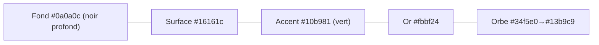

# 🎨 App — Design system

Retour : [[APP/00 - Vue d'ensemble]] · [[🏠 ACCUEIL]]

> [!abstract] Principe
> Style **premium sombre** (type Linear/Apple), validé sur l'écran **Clients**, puis propagé partout via des **composants partagés**. Pour changer tout le look : 1 seul fichier → `simulator/src/components/ui/Premium.tsx`.

## Composants partagés (`ui/Premium.tsx`)

| Composant | Rôle |
|---|---|
| `Hero` | En-tête : eyebrow "Dzaryx · X" + grand titre dégradé + halos + sous-titre |
| `StatCard` | Carte stat : icône + ligne d'accent + halo + nombre dégradé |
| `SearchPill` | Champ recherche en pilule (loupe) |
| `OrbIcon` | L'orbe IA (icône d'app, Voix, Chat) — SVG vectoriel |
| `SkeletonCards` | Squelettes shimmer pendant le chargement |

## Tokens

- **Fond** : `#0a0a0c` (gardé volontairement sombre = premium ; le souci n'était jamais le fond mais les bulles invisibles).
- **Cartes** : `#16161c`, bord `rgba(255,255,255,0.07)`, radius 14-18.
- **Acteur** : Kouider vert `#10b981`, Houari violet `#7c3aed`.
- **Police** : Inter / système. Titres en dégradé `#fff → accent`.

## Identité visuelle

> [!tip] L'orbe, pas la clé
> L'ancienne icône (clé dorée = logo Fik) prêtait à confusion avec le site. → **Orbe IA turquoise + anneau or sur noir** : icône d'app (PWA), écran Voix (central animé), avatar du Chat. Distinct du site, mémorable.

## Règles UI (apprises)

> [!warning] Pièges confirmés
> - **`window.confirm()` / `prompt()` BLOQUÉS en WebView** → toujours une confirmation **inline 2-taps** (Suppr. → Confirmer ?).
> - Ne **jamais** redessiner en masse à l'aveugle : valider 1 écran labo avec screenshots, puis propager.
> - `overflow:hidden` + hauteur fixe = contenu coupé (cas des chips Parc). Laisser la hauteur s'adapter.
> - Toujours `npx tsc --noEmit -p tsconfig.json` avant deploy ; bump `sw.js` (cache) pour forcer le refresh PWA.

## Chat — bulles
Dzaryx = carte sombre bordée + ombre (+ orbe à gauche). Client = bulle turquoise à droite. Espacement clair entre messages.
