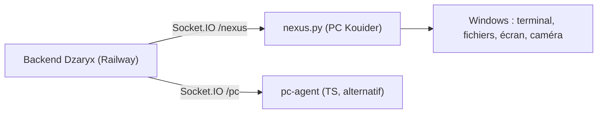

# 🖥️ Nexus & agent PC

Retour : [[APP/00 - Vue d'ensemble]] · [[APP/02 - IA & Outils]]

> [!abstract] C'est quoi
> Des agents qui tournent **sur le PC Windows de Kouider** et que Dzaryx peut piloter à distance (terminal, fichiers, capture écran, vision caméra). Connectés au backend via Socket.IO.

## Nexus (`nexus/`, Python) — principal
- Tourne sur le PC, namespace **`/nexus`**. Watchdog `nexus_watchdog.py` redémarre si crash.
- **Events** : `nexus:command`, `nexus:run_command` (shell sécurisé + blocklist), `nexus:terminal_run` (streaming SSE live), `nexus:screenshot` (→ Telegram), `nexus:sysinfo` (RAM/CPU/uptime), `nexus:write_file`, `nexus:live_frame` (caméra).
- **Sécurité** : blocklist (`format`, `diskpart`, `rm -rf`…), allowlist commandes sûres.
- Fichiers clés : `nexus/modules/ws_client.py` (events), `nexus/modules/os_agent.py` (terminal streaming).

## pc-agent (`pc-agent/`, TypeScript) — alternatif
- Version plus légère, namespace **`/pc`**. Actions : `pc_run_command`, `pc_open_file`, `pc_screenshot`, `pc_list_files`, `pc_read_file`. Même esprit de blocklist.

## Pourquoi
> [!info]
> Permet à Dzaryx d'**agir sur l'ordinateur** (lancer un script, faire une capture, vérifier l'état machine) depuis le téléphone. Surtout utile pour l'automatisation marketing (ex : lancer un post TikTok via script PC) et le contrôle distant.

## État
- Proactif Nexus **désactivé par défaut** (anti-spam) : réactivable avec `NEXUS_PROACTIVE_ENABLED=true` sur Railway.
- Démarrage : `python nexus.py` (ou `launcher.py`) sur le PC. Redémarrage manuel après modif.

> [!note] Hors app mobile
> Nexus n'est pas un écran de l'app : c'est une extension "bras physique" de Dzaryx sur le PC. Le pilotage passe par le chat/vocal.
