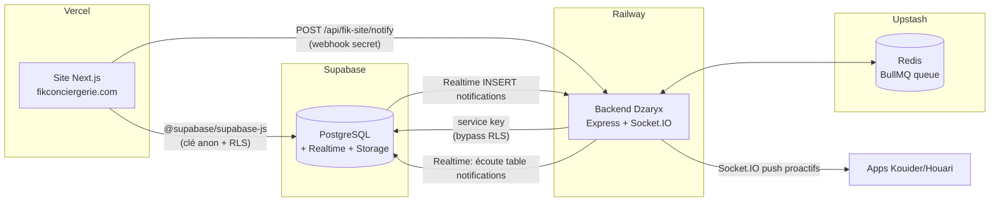
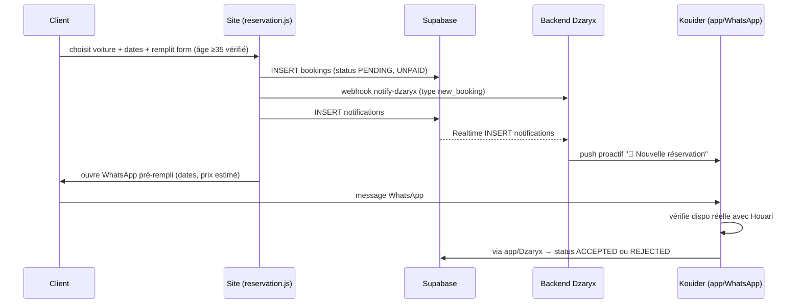
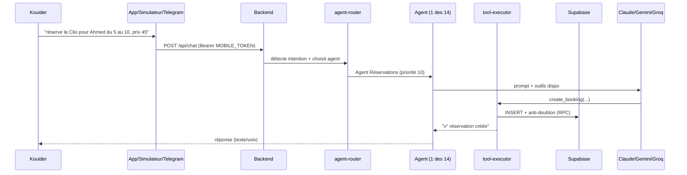

# 02 — Architecture Globale

> Comment les morceaux se parlent. Retour : [[🏠 HUB]]

---

## Vue d'ensemble

Deux applications **indépendantes** (repos séparés, déploiements séparés) reliées par **une base Supabase commune** et **un webhook**.

### Les deux chemins site → Dzaryx (important)

Quand un client réserve sur le site, Dzaryx est prévenu de **2 façons redondantes** :

1. **Webhook direct** : `rental-system/pages/api/notify-dzaryx.js` → POST vers
   `backend /api/fik-site/notify` (header `x-webhook-secret`). Non-bloquant : si Dzaryx est down,
   le site continue. Voir [[04_DZARYX_BACKEND#fik-site-webhook]].
2. **Supabase Realtime** : le site insère une ligne dans la table `notifications`, le backend
   écoute les `INSERT` en Realtime (`index.ts → initFikRealtimeListener`) et pousse vers Kouider + Houari.

> Pourquoi 2 chemins ? Robustesse : si le webhook échoue (timeout, secret manquant), le Realtime
> rattrape. Voir [[08_DECISIONS]].

---

## Flux : une réservation de A à Z

**Point clé** : une réservation site est **toujours `PENDING`** (jamais auto-confirmée). C'est
Kouider qui valide. Voir [[03_SITE#reservation]] et [[08_DECISIONS#mode-dispo]].

---

## Flux : Kouider parle à Dzaryx

Détail du pipeline conversationnel (intent, contexte, anti-hallucination, mémoire) : [[04_DZARYX_BACKEND#pipeline-conversation]].

---

## Namespaces Socket.IO

Le backend expose plusieurs canaux temps réel :

| Namespace | Qui | Usage |
|-----------|-----|-------|
| `/mobile` | Apps Kouider/Houari | Chat live, push proactifs (chambres `actor:kouider`, `actor:houari`, `actor:all`) |
| `/desktop` | (PC) | Connexions desktop |
| `/nexus` | Nexus Python | Commandes PC (shell, screenshot, vision) |
| `/pc` | pc-agent (alt TypeScript) | Alternative à Nexus |

Auth Socket : token dans `handshake.auth.token`, validé par `validateToken(token, 'mobile'|'pc-agent')`.

---

## Sécurité — niveaux d'accès

| Accès | Mécanisme |
|-------|-----------|
| Site public (clients) | Supabase **clé anon** + **RLS** (lecture cars/reviews, insert bookings) |
| Backend → Supabase | **Service key** (bypass RLS, accès total) |
| App → Backend | **Bearer `MOBILE_ACCESS_TOKEN`** (Kouider) / `MOBILE_TOKEN_HOUARI` (Houari) |
| Nexus → Backend | **`PC_AGENT_TOKEN`** |
| Site → Backend webhook | header **`x-webhook-secret`** (= `WEBHOOK_SECRET`) |
| Rate limiting | en mémoire : 120 req/min général, 20 req/min sur `/api/chat` |

> ⚠️ CORS backend = `origin: '*'` + `credentials: true` (à resserrer un jour). Impact limité car
> auth par Bearer token. Voir [[08_DECISIONS]].

---

## Ce qui distingue les "apps" de Kouider

- **App native (dzaryx-native)** = la vraie app du téléphone (APK), celle qu'il utilisera au quotidien.
- **Simulateur** = même idée mais sur le web (GitHub Pages), 12+ écrans, pour tester/démo sans APK.
- **PWA mobile (mobile/)** = ancienne version web installable. Toujours en ligne sur Netlify.

Les trois tapent le **même backend**. Détails : [[05_APPS]].
