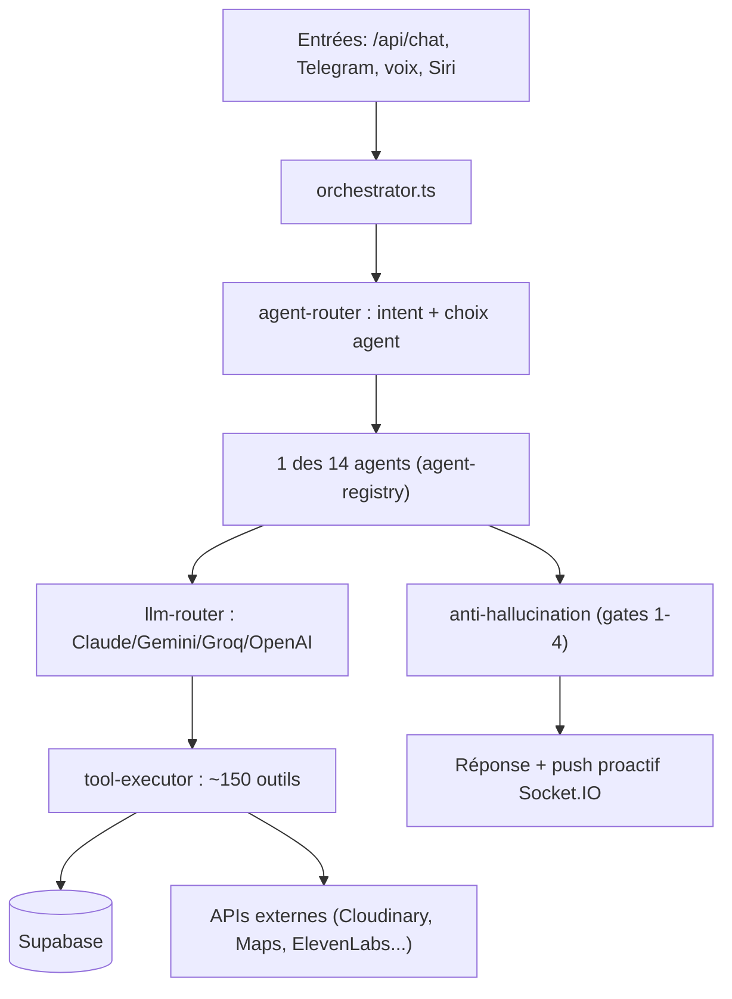

# 04 — Backend Dzaryx

> Repo : `kouider213/ibrahim` · Dossier : `ibrahim/backend`
> Techno : **Node.js + TypeScript + Express + Socket.IO** · Déploiement **Railway** (auto sur push `main`)
> Point d'entrée : `src/index.ts` · Retour : [[🏠 HUB]]

---

## Vue d'ensemble

Le cerveau de tout. Reçoit les messages (app, Telegram, voix), choisit un **agent IA**, exécute des **outils**
qui lisent/écrivent Supabase, répond (texte + voix). Pousse des **proactifs** temps réel. Tourne des **jobs**
schedulés (marketing, rappels). Pilote le **PC** via Nexus.



---

## `src/index.ts` — câblage

- Middlewares : `helmet`, `cors(*)`, `express.json(20mb)`, `cookieParser`, `requestLogger`, **rate limiters**
  (120/min général, 20/min sur `/api/chat`).
- **~35 routes** montées sous `/api/*` (table ci-dessous).
- Endpoints diagnostic : `/health`, `/debug_llm`, `/test_fal`, `/test_replicate`, `/test_ai`.
- Socket.IO : namespaces `/mobile`, `/desktop`, `/nexus`, `/pc`.
- Au démarrage : `initScheduler()`, `initReminderWorker()`, `autoBackfillClientIntel()` (remplit
  `client_intelligence` depuis l'historique si vide), `initFikRealtimeListener()` (écoute table `notifications`).

---

## Routes API (`src/api/routes/`)

| Route | Rôle |
|-------|------|
| `chat.ts` | ⭐ Entrée principale chat (rate-limité 20/min) |
| `bookings.ts` | CRUD réservations |
| `cars.ts` | CRUD véhicules location |
| `clients.ts` | Clients : liste, intelligence, **leads**, **deals/operations**, documents, backfill |
| `immo.ts` | Immobilier + `vehicles_for_sale` (schéma unifié — voir [[08_DECISIONS#properties]]) |
| `finance.ts` | Rapports financiers, dashboard |
| `bi.ts` | Business Intelligence (revenus, flotte) |
| `documents.ts` | Documents clients (passeport, permis, contrat) |
| `calendar.ts` | Google Calendar |
| `vision.ts` | Analyse image (OCR docs, vision) |
| `tts.ts` / `transcribe.ts` | Synthèse vocale (ElevenLabs) / transcription (Whisper) |
| `content.ts` | Génération contenu |
| `nexus.ts` / `nexus-os.ts` | Commandes vers l'agent PC Nexus |
| `multi-agent.ts` / `workflow.ts` / `orchestrator.ts` | Multi-agents, workflows |
| `weather.ts` / `rates.ts` / `maps.ts` / `location.ts` | Météo, taux de change, cartes, géoloc |
| `siri.ts` | Raccourci Siri "Hey Siri Dzaryx" |
| `github.ts` | Lire/écrire le code via GitHub API (l'IA modifie le repo) |
| `pdf.ts` | Génération PDF (contrats, reçus) |
| `push-token.ts` / `notifications.ts` | Push mobile (Expo/FCM/Web Push) |
| `widget.ts` | Ancien widget chatbot site (désactivé) |
| `health-ai.ts` | Santé des providers IA |
| `tasks.ts` / `validations.ts` / `scheduler.ts` | Tâches, file de validation, scheduler |
| `bootstrap.ts` | Données initiales pour l'app au démarrage |
| `fik-site-webhook.ts` | ⭐ Reçoit le webhook du site (`/api/fik-site/notify`) {#fik-site-webhook} |
| `whatsapp.ts` | 🔴 **DÉSACTIVÉ** — bot WhatsApp client (voir [[08_DECISIONS#whatsapp]]) |

---

## Les 14 Agents IA (`src/agents/agent-registry.ts`)

Chaque agent = un **system prompt** + un **sous-ensemble d'outils** + un **provider LLM** + un **regex de mots-clés**
+ une **priorité**. L'`agent-router` choisit l'agent dont le regex matche, en commençant par la priorité la plus haute.

| Prio | Agent | Spécialité | LLM |
|------|-------|-----------|-----|
| 10 | 📋 Réservations | bookings, dispo, immo, vente, photos, leads | Sonnet 4.6 |
| 9 | 💰 Finance | CA, paiements, impayés, reçus | Sonnet (fallback OpenAI) |
| 9 | 🔍 Code Reviewer | audit code, sécurité | GPT-4o (fallback Claude) |
| 9 | 🧠 Obsidian Brain | mémoire long-terme via Nexus | Sonnet |
| 8 | 👤 Clients | documents, WhatsApp, notation | Sonnet |
| 8 | 💻 Code | dev TS/React, GitHub, Railway, Supabase | Sonnet |
| 7 | 📅 Planning | agenda, rappels, météo, actu | Haiku |
| 7 | 🎬 TikTok | vidéos marketing TikTok, tendances | Sonnet |
| 7 | 🎨 Designer | UI/UX, maquettes | Haiku (fallback Groq) |
| 7 | 🌐 Network Analyst | concurrence, SEO, réseaux | Sonnet |
| 6 | 🎨 Marketing | images/vidéos, retouche, sous-titres | Haiku (fallback Groq) |
| 6 | 🎬 Video Creator | pipelines vidéo complets | Sonnet |
| 5 | 🧠 Mémoire | mémoriser, apprendre des règles | Haiku |
| 1 | 🧠 Général | catch-all (toute question) + immo/photos | Sonnet (fallback OpenAI) |

> ⚠️ Anti-hallucination dur dans les prompts : interdiction d'inventer prix/concurrents (Network Analyst),
> jamais confirmer dispo voiture à un client (Réservations), toujours appeler l'outil avant de dire "pas de X".

---

## Outils Claude (`src/integrations/tool-executor.ts` + `tools.ts`)

Le fichier le plus gros (~5000 lignes). ~150 outils. Catégories :
- **Réservations** : `create_booking, update_booking, cancel_booking, check_car_availability, list_bookings...`
- **Finance** : `get_financial_report, record_payment, get_unpaid_bookings, generate_receipt...`
- **Immo/vente** : `list_properties, create_property, update_property, mark_vehicle_sold, add_vehicle_for_sale...`
- **Leads** : `record_lead, list_leads, update_lead_status, match_lead`
- **Photos** : `get_car_photo, get_property_photo, get_vehicle_sale_photo` (émis via `emitProactive` + 400ms entre chaque)
- **Clients** : `store_document, get_client_document, rate_client, get_client_history, record_client_deal`
- **Marketing** : `generate_image, enhance_image, add_text_overlay, create_marketing_video, generate_tiktok_video...`
- **Mémoire** : `remember_info, recall_memory, learn_rule, get_kouider_preferences`
- **Code/infra** : `github_read_file, github_write_file, railway_get_logs, supabase_execute, netlify_deploy`
- **Web** : `web_search, get_news, get_weather`
- **Nexus/PC** : `send_nexus_command, ping_nexus, restart_nexus, obsidian_*`

> **Règle absolue** : un outil retourne **toujours une string** (jamais objet/array), sinon le pipeline casse.

---

## Nouveautés 2026-06-07 (création annonces + photos via chat, vision chat)

### Photos jointes au chat → attachées à une nouvelle annonce {#session-photos}
- **Endpoint** : `POST /api/cars/session-photos` (`cars.ts`) — upload des photos jointes vers **Cloudinary**, puis
  cache **Redis** sous `session:photos:{sessionId}` (TTL **15 min**). Renvoie `{count}`.
- **Consommation** : `attachSessionPhotos(sessionId, kind, id)` (dans `tool-executor.ts`) est appelée par les tools
  de création pour lier les photos cachées à la nouvelle ligne **et** poser `image_url = photos[0].url` :
  | Type | Tool | Table photos |
  |---|---|---|
  | Voiture location | `add_car` | `car_photos` |
  | Immobilier (loc/vente) | `create_property` | `property_photos` |
  | Voiture à vendre | `add_vehicle_for_sale` | `vehicle_sale_photos` |
  | Pack | `create_pack` | (photo principale `image_url`) |
- **Frontend** : `simulator/.../TextScreen.tsx` → `isCreateIntent` distingue **création** vs **store voiture existante**
  vs **vision** ; upload via `api.uploadSessionPhotos`.
- **Fix associé** : `add_car` était **hors scope** des agents → ajouté aux agents **Réservations + Général**
  (`4856275`), sinon Dzaryx ne pouvait pas créer de voiture de location.

### Vision dans le chat (bypass des guards business)
- Quand `imageBase64` est présent, on **bypass** `fastPathGuard`/`checkAntiHallucination` (`e54811b`) : la réponse
  décrit l'image (pas une requête DB) et était écrasée à tort par `FAST_PATH_REFUSAL`.

### Matching véhicule par score de tokens
- `/api/cars/photos` matche désormais par **score de tokens** (≥3 lettres) au lieu d'exiger tous les mots
  (`d4aa670`) — un token "9" cassait "Jumpy 9 Places".

### Réservations multi-acteurs
- `create_booking` attribue au bon acteur (Kouider/Houari) ; le check de dispo dit **QUI** a bloqué (acteur+client+
  dates) ; la liste filtre par acteur (`7283337`). Pour le cas "les deux connectés en même temps".

---

## Pipeline conversationnel {#pipeline-conversation}

Dossiers `src/conversation/` + `src/orchestrator/`. Étapes (simplifiées) :

1. **`language-detector`** + **`normalizer`** : langue (FR/AR/darija) + nettoyage.
2. **`intent-detector`** (Haiku, rapide) : détecte l'intention.
3. **`context-builder` / `context-engine`** : charge le contexte (réservations, finances, mémoire, ~20 sources).
4. **`agent-router`** : choisit l'agent.
5. **`memory-engine` / `memory-selector`** : injecte la mémoire pertinente (`ibrahim_memory`, `actor_brain`).
6. **LLM** via `llm-router` (Claude principal, fallback Gemini/Groq/OpenAI).
7. **`anti-hallucination`** (gates 1-4 bloquants) : vérifie que l'IA n'invente pas de chiffres.
8. **`response-guard`** : filtre final.
9. **`auto-memory` / `episode-tracker`** : mémorise ce qui compte pour la prochaine fois.

> ⚡ Optimisation vitesse (2026-06-03) : en mode **vocal**, le "thinking" Claude est désactivé (réponse plus
> rapide). Budgets thinking réduits en texte. Voir [[08_DECISIONS]].

---

## Queue & jobs (`src/queue/`)

BullMQ + Redis (Upstash). ~25 jobs schedulés. Principaux dans `jobs/proactive-jobs.ts` :
- Marketing hebdo (génère une vidéo d'une voiture + push).
- Rappels (retours en retard, paiements).
- Briefings.

`scheduler.ts` lance les jobs cron, `worker.ts` les exécute.

---

## Marketing & média (`src/marketing/`, `src/integrations/media-*`)

Pipeline vidéo TikTok : `create-marketing-video`, `scene-assembler`, `run-video-job`, `social-poster`.
Génération image/vidéo IA via **Replicate (Flux)**, **fal.ai (Kling/WAN)**, **Kling AI**, **Runway**.
Hébergement média : **Cloudinary** + Supabase Storage (bucket `videos`).

---

## Business Intelligence (`src/bi/`)

`revenue-intelligence` (CA semaine/mois), `fleet-intelligence` (état parc), `tiktok-intelligence`,
`whatsapp-intelligence`, `smart-reminders`. Poussé vers l'app via `bi-socket`.

---

## Notifications (`src/notifications/`)

`mobile-push` (⭐ `emitProactive(title, type, message, actor, screen)` — la fonction qui pousse vers l'app),
`fcm` (Firebase), `pushover`, `web-push-service`, `email`, `dispatcher`.

---

## Finance — règle métier critique

```
Bénéfice Kouider = (resale_price - base_price) × nb_days
Part Houari      = base_price × nb_days
CA total         = final_price (= resale × nb_days, ajusté remises)
Garantie         : CA = Part Kouider + Part Houari
Si base_price NULL → profit = null (JAMAIS inventé)
```
Fichiers : `integrations/finance.ts` (`computeBookingFinancials`), `phase5-finance.ts` (`resolveFinancials` dashboard).
Anti-hallucination : `orchestrator/anti-hallucination.ts` (gates 2+3 bloquants).
