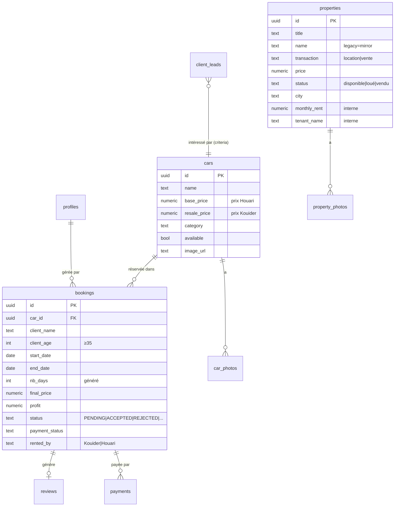

# 07 — Modèle de Données (Supabase)

> Projet Supabase : **febrrgqpyqqrewcohomx** (partagé site + Dzaryx)
> Dashboard : https://supabase.com/dashboard/project/febrrgqpyqqrewcohomx
> Retour : [[🏠 HUB]]

---

## Principe

**Une seule base** pour tout. Le **site** y accède avec la **clé anon** (limité par RLS). Le **backend Dzaryx**
y accède avec la **service key** (accès total). Les migrations `0001→0017` vivent dans le repo **site**
(`rental-system/supabase/`), les migrations `migration_*.sql` dans le repo **Dzaryx** (`ibrahim/supabase/`).

---

## Diagramme relations (cœur business)

---

## Tables — référence complète

### 🚗 Business location (schema.sql de base)

**`cars`** — véhicules de location
`id, name, base_price (prix Houari), resale_price (prix Kouider), image_url, category, seats, fuel, transmission, available, description, created_at`
+ ajout : `currency` (0007), `featured` (0008).
Catégories : berline, premium, SUV, citadine, familiale, utilitaire.

**`bookings`** — réservations
Base : `id, car_id, user_id, client_name, client_email, client_phone, client_age, client_passport, start_date, end_date, nb_days (généré = end−start), base_price_snapshot, resale_price_snapshot, final_price, profit, status, notes, whatsapp_sent, sms_sent, pdf_url, created_at, updated_at`
+ migrations : `payment_status, paid_amount, deposit...` (0002), `currency`, `client_price_per_day, owner_price_per_day, discount_applied, rented_by`.
- **status** : base CHECK = `PENDING|ACCEPTED|REJECTED`, mais le code Dzaryx utilise aussi `CONFIRMED|ACTIVE|COMPLETED` (le CHECK a été assoupli en prod).
- ⭐ **nb_days est GÉNÉRÉ** (colonne calculée) — ne pas l'écrire à la main.

**`car_photos`** (migration `0004`) — multi-photos par voiture
`id, car_id (FK CASCADE), url, position (0 = principale), created_at`. RLS : lecture publique, écriture admin.

**`reviews`** — avis clients
`id, booking_id, client_name, rating (1-5), comment, approved, created_at`. RLS : seules `approved=true` lisibles.

**`profiles`** — admins (lié à `auth.users`)
`id, name, role ('kouider'|'houari'|'admin'), phone, created_at`.

**`payments`** — paiements
`id, booking_id, amount, method, status, is_deposit, reference, paid_at, refunded_at, ...`.

### 🏠 Immobilier & vente (migrations site 0005, 0013, 0014)

**`properties`** — biens immobiliers (⚠️ **table à 2 histoires** — voir [[08_DECISIONS#properties]])
- Ancien (module Houari) : `name, address, type, status (libre/loué), monthly_rent, tenant_name, notes`.
- Site (migration `0014`) : `title, city, district, price, price_type, surface, rooms, floor, description, image_url` + `transaction (location|vente)`.
- **Schéma unifié actuel** (depuis 2026-06-05) : on écrit `title` (+`name` mirror legacy NOT NULL), `transaction`, `price`, `status` normalisé (`libre`→`disponible`). `monthly_rent`/`tenant_name` gardés pour gestion interne.
- Le **site n'affiche que `status='disponible'`**.
- 📊 **État prod 2026-06-05 : table VIDE (0 ligne).**

**`property_photos`** — photos des biens : `id, property_id, url, position`.

**`vehicles_for_sale`** (migration `0005`) — voitures à vendre
`id, brand, model, year, price, currency, status (disponible|réservé|vendu), mileage, fuel, transmission, image_url, created_at`.

**`client_deals`** (migration `0013`) — opérations immo/vente/demandes d'un client
`id, client_name, client_phone, deal_type (location_immo|vente_immo|vente_voiture|demande_specifique), item_label, item_table, item_id, amount, currency, status, created_at`.

**`client_leads`** (migration `0016`) — demandes/leads clients (recherches en cours)
`id, client_name, client_phone, category (immo_location|immo_vente|voiture_location|voiture_vente), criteria, budget_max, currency, city, status (nouveau|en_cours|...), notes, created_at, updated_at`.

### ⚙️ Réglages & analytics (migrations site 0003, 0006, 0011, 0017)

**`site_settings`** (id=1, ligne unique) — tous les réglages du site
WhatsApp(s), logo_url, email, phone, address, maps_url, réseaux, acompte_pct, stats, **hero_media_url** (0015),
hero_title/subtitle, announcement, **chatbot_enabled** (0012), **availability_mode** (0017).

**`page_views`**, **`car_views`** (migration `0003`) — analytics : page/device/country/session_id, car_id.

### 📱 WhatsApp booking flow (migration Dzaryx `migration_wa_booking_flow`)

**`wa_booking_requests`** — flow de réservation WhatsApp guidé (collecte infos, validation, acompte, docs).
Statuts : `pending_info → pending_approval → payment_requested → docs_requested → confirmed | cancelled`.
> Lié au bot WhatsApp client, **désactivé** actuellement (voir [[08_DECISIONS#whatsapp]]).

### 🧠 Tables Dzaryx (IA / mémoire — repo ibrahim)

`conversations, ibrahim_memory, ibrahim_rules, learned_rules, integrations, notifications, tasks, task_runs,
validations, user_preferences, projects, assistant_profiles, user_behavior, conversation_patterns, contracts,
document_access_logs, payment_logs, vehicle_states, client_intelligence, dzaryx_observations, actor_brain`.

Les plus utiles :
- **`client_intelligence`** — profil enrichi par client (score VIP/FREQUENT, total dépensé, arrival_patterns, ai_insights, notes). Rempli par `updateClientIntelFromBooking` (backfill au démarrage backend).
- **`notifications`** — table écoutée en Realtime par le backend (pont site → push). Voir [[02_ARCHITECTURE]].
- **`actor_brain`** — vocabulaire/style de Kouider vs Houari (l'IA apprend leur façon de parler).
- **`vehicle_states`** — inspection véhicule avant/après location.

---

## Fonctions / RPC

- **`check_car_availability(car_id, start, end, exclude_id)`** → BOOLEAN. Anti-double-réservation : renvoie
  false s'il existe un booking `PENDING|ACCEPTED` qui chevauche. **Toujours l'utiliser** avant de créer.
- `create_booking_safe`, `insert_booking_safe`, `get_booking_summary`, `check_vehicle_availability` — variantes RPC.
- Triggers `updated_at` automatiques sur `bookings`, `properties`, `wa_booking_requests`.

---

## RLS (Row Level Security)

| Table | Lecture | Écriture |
|-------|---------|----------|
| `cars` | publique | admins (role kouider/houari) |
| `bookings` | authentifiée | INSERT public, UPDATE admins |
| `reviews` | `approved=true` publique | INSERT public, UPDATE admins |
| `properties` | (via service key backend / anon site) | service key |
| `site_settings` | publique | admin (RLS fix 0010) |

> ⚠️ Le backend Dzaryx utilise la **service key** → **bypass total du RLS**. Donc toute la sécurité
> "métier" côté Dzaryx repose sur le **Bearer token mobile**, pas sur RLS.

---

## ⏳ Deadline migrations — 29 juillet 2026

Kouider ne touchera plus Supabase à partir du **29/07/2026** (août en Algérie, gestion par clics seulement).
**Toute migration SQL doit être passée AVANT.** État : `0015`, `0016`, `0017` ✅ faits (confirmé 2026-06-05).
