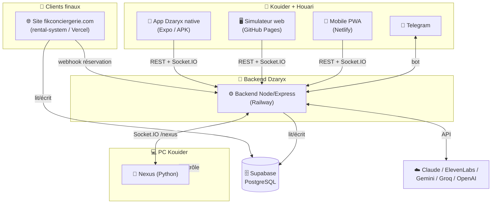

# 🏠 HUB — Centre de Documentation Fik Conciergerie / Dzaryx

> **Point d'entrée unique.** Audité et écrit le **2026-06-05**.
> But : qu'une personne (ou un Claude) qui n'a JAMAIS vu ce projet puisse reprendre
> le travail comme si elle l'avait construit. Chaque détail, chaque décision, chaque pourquoi.

---

## ⚡ Tu reprends le projet ? Lis dans cet ordre

1. [[01_DEMARRAGE_RAPIDE]] — c'est quoi, qui, comment lancer chaque morceau (5 min)
2. [[02_ARCHITECTURE]] — vue d'ensemble + diagrammes
3. [[10_JOURNAL_SESSION]] — **où on s'est arrêté EXACTEMENT** (le plus important pour reprendre)
4. Puis le doc du morceau sur lequel tu bosses (ci-dessous)

---

## 🗺️ Carte du projet



> 🖱️ Vue interactive (zoom/déplacement) : ouvre **[[system-map.canvas|🗺️ Carte interactive (Canvas)]]**

---

## 📚 Tous les documents

| # | Doc | Contenu |
|---|-----|---------|
| 01 | [[01_DEMARRAGE_RAPIDE]] | Onboarding express, lancer chaque morceau |
| 02 | [[02_ARCHITECTURE]] | Architecture globale + diagrammes + flux |
| 03 | [[03_SITE]] | Site fikconciergerie (pages, API, admin, migrations) |
| 04 | [[04_DZARYX_BACKEND]] | Backend (routes, agents, orchestrateur, queue, IA) |
| 05 | [[05_APPS]] | App native, simulateur, PWA mobile |
| 06 | [[06_NEXUS]] | Agent PC Python |
| 07 | [[07_DATA_MODEL]] | Toutes les tables Supabase + relations + RLS |
| 08 | [[08_DECISIONS]] | **Pourquoi** on a enlevé / remplacé / gardé chaque chose |
| 09 | [[09_ENV_DEPLOIEMENT]] | Variables d'env, hébergement, déploiement |
| 10 | [[10_JOURNAL_SESSION]] | **Journal vivant** — chaque changement noté en temps réel |

---

## 🚦 État du projet (2026-06-07)

| Morceau | État | Hébergement | Note |
|---------|------|-------------|------|
| 🌐 Site | 🟢 LIVE | Vercel — fikconciergerie.com | Mode "dispo à confirmer" ON ; packs live |
| ⚙️ Backend | 🟢 LIVE | Railway | WhatsApp client off ; création annonces+photos via chat ✅ |
| 📱 App native | 🟡 Dev | APK juin 2026 (Expo SDK 54) | Redesign Gemini + overlay ✅ ; wake word "Zaria" 🟡 ne fire pas |
| 🖥️ Simulateur | 🟢 LIVE | GitHub Pages | kouider213.github.io/ibrahim — **= l'UI réelle de l'app** (cache SW v43) |
| 📲 PWA mobile | 🟢 LIVE | Netlify | |
| 🤖 Nexus | 🟡 Manuel | PC Kouider | Démarrage manuel |
| 🗄️ Supabase | 🟢 LIVE | projet febrrgqpyqqrewcohomx | migrations 0015-0018 faites |

> 🛑 **Où on s'est arrêté (2026-06-07)** : tout déployé + testé live. Reste optionnel = wake word (besoin logs
> device), upload PDF/Excel chat, vérifs device. Play Store exclu pour l'instant. Détails → [[10_JOURNAL_SESSION]].

---

## 🔑 Liens & accès rapides

| Service | URL |
|---------|-----|
| Site public | https://fikconciergerie.com · https://autolux-location.vercel.app |
| Admin site | https://autolux-location.vercel.app/admin |
| Backend Railway | https://ibrahim-backend-production.up.railway.app |
| Backend health | https://ibrahim-backend-production.up.railway.app/health |
| Simulateur | https://kouider213.github.io/ibrahim/ |
| PWA Netlify | https://ibrahim-fik-conciergerie.netlify.app |
| Supabase | https://supabase.com/dashboard/project/febrrgqpyqqrewcohomx |
| GitHub site | github.com/kouider213/autolux-location (privé) |
| GitHub Dzaryx | github.com/kouider213/ibrahim (privé) |

---

## 📍 Où vit le code (sur le PC)

```
C:\Users\douba\OneDrive\Bureau\
├── ibrahim\ibrahim\        ← DZARYX (backend, apps, nexus) — repo kouider213/ibrahim
│   └── DZARYX\AUDIT\        ← CETTE DOCUMENTATION (vault Obsidian)
└── rental-system\          ← LE SITE — repo kouider213/autolux-location
```

> ⚠️ Le site (`rental-system`) et Dzaryx (`ibrahim`) sont **2 repos séparés** mais
> partagent la **même base Supabase**. C'est la clé pour tout comprendre.

---

*Docs maintenues par Claude. Voir [[10_JOURNAL_SESSION]] pour le dernier état exact.*
