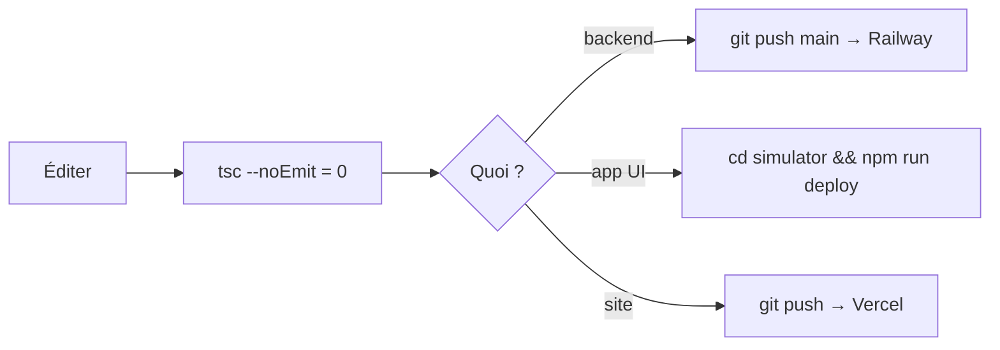

# 👨‍💻 Guide Développeur — Reprendre le projet de zéro

Retour : [[🏠 ACCUEIL]]

> [!goal] Objectif
> Après ce guide, tu comprends le projet comme si tu l'avais créé : où est quoi, comment build/deploy, les pièges, les règles.

## 1. Les 2 dépôts

| Repo | Contenu | Deploy |
|---|---|---|
| `kouider213/ibrahim` | `backend/` (Express/TS), `simulator/` (UI app), `dzaryx-native/` (Expo), `nexus/` (PC), `DZARYX/` (ce vault) | Railway (backend) + gh-pages (sim) |
| `kouider213/autolux-location` | Site Next.js (`rental-system/`) | Vercel |

## 2. Lancer en local

```bash
# Backend
cd backend && npm run dev
# Simulateur (UI app)
cd simulator && npm run dev
# Site
cd rental-system && npm run dev
```

## 3. Build & deploy



> [!danger] Règles de code (jamais déroger)
> 1. `tsc --noEmit` à 0 avant commit.
> 2. `git add <fichiers précis>` — jamais `git add -A`.
> 3. Finance : `profit = (client_ppd − owner_ppd) × jours` ; jamais de catalogue ; null si owner absent.
> 4. tool-executor : toujours renvoyer une **string**.
> 5. Co-Authored-By en fin de commit.

## 4. Pièges (à connaître absolument)

> [!bug] WebView
> - `window.confirm/prompt` **bloqués** → confirmation inline.
> - Après deploy simulateur : **fermer/rouvrir l'app à fond** (service worker sert l'ancienne UI). Bump `sw.js` (CACHE `dzaryx-vNN`).
> - L'UI réelle = `simulator/`, **pas** d'écrans natifs. Nav = `Phone.tsx` (`TABS` + `renderScreen`). Des écrans existent en double (ex: `ImmoScreen` mort vs `ImmoProScreen` live) → vérifier `renderScreen` avant d'éditer.

> [!bug] Backend / site
> - CSP helmet bloque le JS inline sur `/sign` → middleware relâché.
> - Vercel Hobby = **2 crons max** (machine à avis fusionnée dans `reminders`).
> - Écritures admin = **clé service** (contourne RLS). Écritures publiques = policy RLS.

## 5. Où trouver quoi

| Besoin | Fichier |
|---|---|
| Comprendre l'archi | [[📐 ARCHITECTURE]] |
| Site ↔ app | [[🧩 ECOSYSTEME]] |
| Tables | [[🗄️ BASE_DONNEES]] |
| Cerveau IA | [[APP/02 - IA & Outils]] |
| Design | [[APP/03 - Design system]] |
| Journal live | [[AUDIT/10_JOURNAL_SESSION]] |

## 6. Variables d'env
- **Railway (backend)** : `GROQ_API_KEY`, `GEMINI_API_KEY`, `FIREBASE_SERVICE_ACCOUNT_JSON`, `INTERNAL_API_TOKEN`, `FIK_SITE_URL`, Google Calendar, Supabase, Redis, Cloudinary, ElevenLabs.
- **Vercel (site)** : `RESEND_API_KEY/FROM`, `GROQ_API_KEY`, `INTERNAL_API_TOKEN`, Google Calendar, Telegram, `CRON_SECRET`, Supabase.

> [!tip] Première chose à lire en arrivant
> [[🏠 ACCUEIL]] → [[📐 ARCHITECTURE]] → [[🧩 ECOSYSTEME]] → ce guide. Puis le `système.canvas`.
