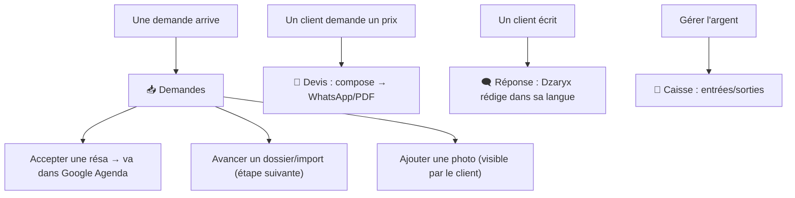

# 🙋 Guide Utilisateur — Faire tourner le business avec l'app

Retour : [[🏠 ACCUEIL]] · Détail écrans : [[APP/01 - Écrans]]

> [!goal] Pour qui
> Toi (Kouider) — comment utiliser Dzaryx au quotidien, sans rien savoir du code.

## Le réflexe du matin

> [!tip] Ouvre **☀️ Aujourd'hui**
> Tu vois d'un coup : qui part, qui rend sa voiture, combien tu dois encaisser, les nouvelles demandes. Tape 💬 pour relancer un client en 1 clic.

## Les gestes du quotidien

## Recettes (comment faire…)

> [!question] Faire un devis voiture + logement
> 🧮 **Devis** → 🚗 ajoute la voiture (jours) → ＋ ajoute "Appartement 3 nuits" → choisis la langue → **WhatsApp** ou **PDF**.

> [!question] Répondre vite à un client arabe
> 🗨️ **Réponse** → colle son message → choisis **Darija** → 🤖 Rédiger → ajuste → **Envoyer WhatsApp**.

> [!question] Accepter une réservation
> 📥 **Demandes** → la résa (🚗) → **Accepter**. Le client reçoit la confirmation, et ça part dans ton **Google Agenda** automatiquement.

> [!question] Lancer une promo / du contenu
> 📱 **Social** → sujet → génère le post + hashtags → copie dans Insta/TikTok. Ou ✍️ **Blog** → rédige avec l'IA → publie sur le site.

> [!question] Récompenser les clients fidèles
> 🎁 **Parrainage** → crée un code → partage WhatsApp. Quand un client l'entre à la réservation, le compteur monte tout seul.

> [!question] Relancer les clients perdus
> 🔁 **Relance** → liste des clients pas revenus → 💬 en 1 tap.

## Voix & Chat
- 🎙️ **Voix** : appuie sur l'orbe, parle ("crée une résa", "montre les revenus du mois"). Dzaryx répond à voix haute.
- 💬 **Chat** : écris pareil, joins des photos (pour créer une annonce ou analyser un dégât).

## Bon à savoir

> [!info]
> - **Hors ligne** : l'app garde les dernières infos même sans réseau (lecture). Une bannière orange te le dit.
> - **Après une mise à jour** : ferme/rouvre l'app à fond pour avoir la dernière version.
> - **Tout est lié au site** : ce que tu fais ici se voit sur le site, et inversement.
