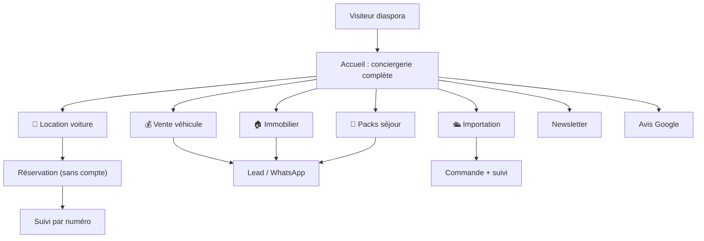

# 🌐 Site Fik Conciergerie — Vue d'ensemble

Retour : [[🏠 ACCUEIL]] · Détail : [[SITE/01 - Fonctionnalités]] · [[SITE/02 - Pages & APIs]]

> [!abstract] Le site en une phrase
> La vitrine + le moteur de réservation de Fik Conciergerie (Oran), pour la **diaspora algérienne** (FR / AR / EN). Location voiture, vente, immobilier, packs séjour, importation — gérable A→Z sans coder, **€0 de coût fixe**.

## Pourquoi ce site existe

> [!question] Le problème
> Kouider visait "le meilleur site d'Algérie" pour la conciergerie : capter la diaspora qui réserve à distance, dans sa langue, sans friction (pas de compte), et tout piloter sans développeur — le tout sans abonnement.

## Ce que fait le site

## Principes de conception

| Principe | Pourquoi |
|---|---|
| **Pas de compte client** | Friction zéro pour la diaspora. Suivi par n° de commande. |
| **100% FR / AR / EN + RTL arabe** | Le client lit/écrit dans sa langue ; "client arabe → réponse arabe". |
| **€0 de coût fixe** | Vercel + Supabase + Resend + Groq gratuits. Seul le domaine coûte. |
| **WhatsApp partout** | La diaspora vit sur WhatsApp → chaque action propose un message pré-rempli. |
| **SEO local Oran** | NAP unifié, schema, pages métier, avis Google → être #1. |
| **Tout éditable depuis l'admin** | Kouider gère sans coder (paramètres, annonces, pages légales). |

## Stack (rappel)

Next.js 14 (pages router) · Tailwind · Framer Motion · Supabase · Resend · déployé **Vercel**. Repo `kouider213/autolux-location`. Détail : [[📐 ARCHITECTURE]].

## Lien avec l'app

Tout ce qui arrive ici (réservations, leads, dossiers, imports, avis, abonnés) remonte dans l'app Dzaryx via la **base partagée**. Voir [[🧩 ECOSYSTEME]].
