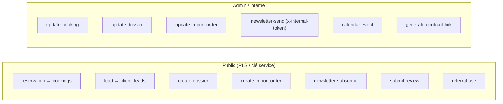

# 🔌 Site — Pages, APIs & Crons

Retour : [[SITE/00 - Vue d'ensemble]] · [[SITE/01 - Fonctionnalités]]

## Pages admin (`pages/admin/`)

| Page | Rôle |
|---|---|
| `index` | Dashboard (KPI, résas) |
| `bookings` | Réservations (statuts, contrat, calendar-event à l'accept) |
| `cars` | Véhicules + multi-photos + maintenance |
| `clients` | Fiche clients |
| `immo` / `vehicles-sale` / `packs` | Annonces |
| `import` / `dossiers` / `leads` | Suivis & demandes |
| `newsletter` | Campagnes |
| `reviews` | Modération avis |
| `comptabilite` | Caisse + export |
| `blog` / `pages` / `faq` / `conditions` | Contenu & légal |
| `equipe` / `compte` | Comptes admin (super-admin) |
| `analytics` | Vues, Clarity |

## APIs publiques/admin (`pages/api/`)

> [!info] Endpoints clés
> - `update-booking` / `update-dossier` / `update-import-order` — whitelist + **email auto** si le statut change. Appelés par le site **et** par l'app (proxy backend).
> - `calendar-event` — crée l'event Google à l'acceptation.
> - `newsletter-send` — campagne ; accepte un **token interne** (app) en plus de la session admin.
> - `upload-car-image` — base64 → bucket Supabase → URL (réutilisé pour photos dossier/import/devis).

## Crons (Vercel — `vercel.json`)

> [!warning] Plan Vercel Hobby = **2 crons max**
> D'où la fusion : la machine à avis est intégrée dans le cron `reminders`.

| Cron | Heure | Fait |
|---|---|---|
| `reminders` | 8h | Rappel J-1 **+** machine à avis (locations finies hier → email avis Google) |
| `lead-followup` | 9h | Relance leads >2j |
| `keep-alive` | quotidien | Empêche la pause Supabase free |

## Emails (`lib/email.js`)
Resend HTTP. `RESEND_API_KEY` + `RESEND_FROM` (domaine `fikconciergerie.com` vérifié). Helper `T(lang,{fr,ar,en})` + `wrap()`. Templates : booking reçu/statuts, reminder J-1, import/dossier status, reviewRequest, newsletter, welcome.

> [!note] Variables d'env (Vercel)
> `RESEND_API_KEY`, `RESEND_FROM`, `GROQ_API_KEY`, `INTERNAL_API_TOKEN`, `GOOGLE_CLIENT_EMAIL`/`GOOGLE_PRIVATE_KEY`/`GOOGLE_CALENDAR_ID`, `TELEGRAM_BOT_TOKEN`/`TELEGRAM_CHAT_ID`, `CRON_SECRET`, `SUPABASE_*`.
