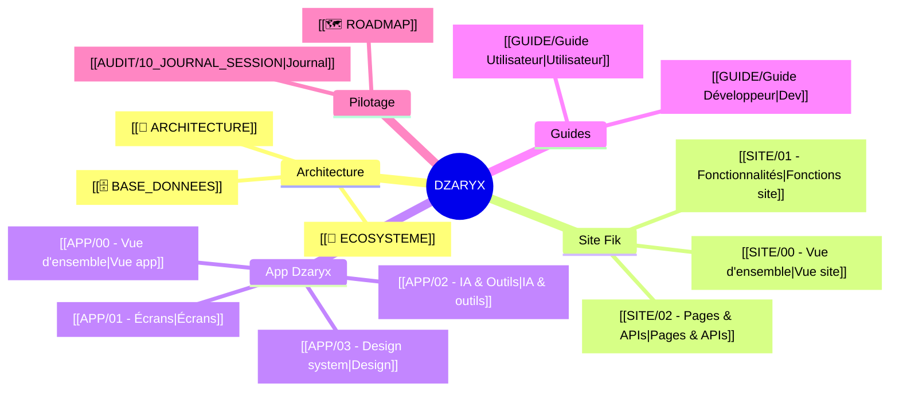
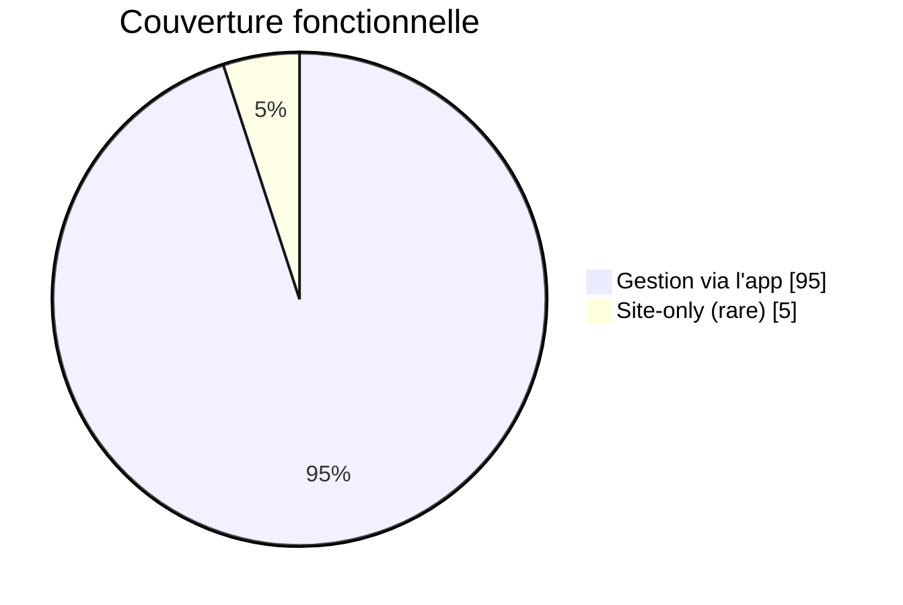

# 🏠 DZARYX × FIK CONCIERGERIE — Vault

> [!abstract] C'est quoi ce vault ?
> La documentation **vivante et complète** de l'écosystème : le **site** Fik Conciergerie (vitrine + réservation, clientèle diaspora) et l'**app Dzaryx** (assistant IA de gestion A→Z). Tout : architecture, code, fonctionnalités, **pourquoi** chaque choix, **comment** s'en servir, et comment les deux se parlent.
> Pensé pour qu'un **développeur** comprenne le projet comme s'il l'avait créé, ET qu'un **utilisateur** sache tout faire.

## 🧭 Navigation rapide

## 🗂️ Les documents

| Doc | Pour qui | Contenu |
|---|---|---|
| [[📐 ARCHITECTURE]] | Dev | Stack, hébergement, flux de données, schémas |
| [[🧩 ECOSYSTEME]] | Dev + métier | Comment le site et l'app se parlent (la base partagée) |
| [[🗄️ BASE_DONNEES]] | Dev | Toutes les tables Supabase + diagramme ER |
| [[SITE/00 - Vue d'ensemble]] | Tous | Le site en bref |
| [[SITE/01 - Fonctionnalités]] | Tous | Chaque fonction : quoi/pourquoi/comment |
| [[SITE/02 - Pages & APIs]] | Dev | Routes, pages, endpoints, crons |
| [[APP/00 - Vue d'ensemble]] | Tous | L'app en bref |
| [[APP/01 - Écrans]] | Tous | Chaque onglet expliqué |
| [[APP/02 - IA & Outils]] | Dev | Le cerveau, les 151 outils, la résilience €0 |
| [[APP/03 - Design system]] | Dev | Composants Premium, couleurs, règles UI |
| [[GUIDE/Guide Développeur]] | Dev | Reprendre le projet de zéro |
| [[GUIDE/Guide Utilisateur]] | Kouider | Faire tourner le business avec l'app |
| [[🗺️ ROADMAP]] | Pilotage | Fait / à venir (timeline) |
| `système.canvas` | Visuel | Carte interactive de tout l'écosystème |

## 🎯 En une phrase

> [!tip] La vision
> **Site** = la vitrine qui capte la diaspora (FR/AR/EN, €0 de coût fixe). **App Dzaryx** = le cerveau qui gère tout depuis le téléphone. Les deux sur **la même base Supabase** → ce qui arrive sur le site apparaît dans l'app, et ce qu'on fait dans l'app modifie le site. Objectif : **la conciergerie la plus avancée d'Oran**.

## 📊 État du projet (2026-06-14)

- ✅ Site complet (location, vente, immo, packs, suivi, leads, newsletter, SEO, contrats)
- ✅ App complète (151 outils IA, vocal, vision, devis, WhatsApp assistant, caisse, avis, blog, parrainage, prévision, CRM…)
- ✅ Design premium uniforme · ✅ Mode hors-ligne · ✅ €0 (sauf Railway)
- 🔭 Suite : voir [[🗺️ ROADMAP]]
