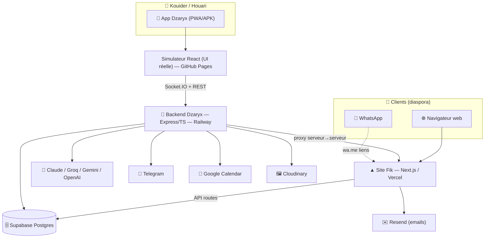
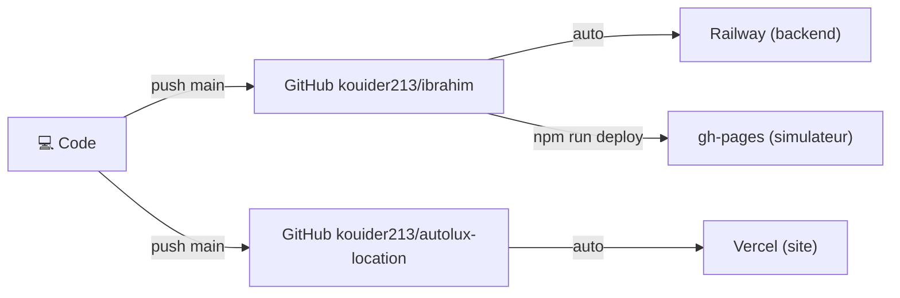

# 📐 Architecture

Retour : [[🏠 ACCUEIL]] · Suite : [[🧩 ECOSYSTEME]] · [[🗄️ BASE_DONNEES]]

## Vue d'ensemble du système

> [!info] Pourquoi cette séparation site / app ?
> - Le **site** doit être public, rapide, SEO, multilingue → **Next.js sur Vercel** (serverless, gratuit, ISR).
> - L'**app** doit être un cerveau temps réel (vocal, sockets, IA, jobs) → **backend Express persistant sur Railway**.
> - **Pourquoi pas tout dans un seul backend ?** Le site serverless = €0 et scalable ; un serveur 24/7 pour le site coûterait. Le cerveau, lui, a besoin d'être toujours allumé (sockets, proactif). On sépare les besoins.

## Stack technique

| Couche | Techno | Hébergement | Pourquoi |
|---|---|---|---|
| Site | Next.js 14 (pages router), Tailwind, Framer Motion | **Vercel** | Serverless gratuit, ISR, SEO |
| App (UI) | React 18 + Vite (simulateur) | **GitHub Pages** (gh-pages) | Statique gratuit, chargé en WebView |
| App (coquille) | Expo SDK 54 / React Native | APK Android | Vocal natif, push, overlay |
| Backend | Node.js + TypeScript + Express + Socket.IO | **Railway** (~5€/mois) | Persistant, sockets, jobs |
| Base | Supabase (PostgreSQL + Storage + RLS) | Supabase | Partagée site+app, RLS, realtime |
| Cache/Queue | Upstash Redis + BullMQ | Upstash | Jobs, nonce, historique proactif |
| IA | Claude Opus/Sonnet → Groq → Gemini → OpenAI | API | Cascade résilience (voir [[APP/02 - IA & Outils]]) |
| Emails | Resend (site) | Vercel env | Domaine vérifié `fikconciergerie.com` |
| Agenda | Google Calendar (service account) | — | Sync réservations |
| Médias | Cloudinary + Supabase Storage | — | Photos véhicules/biens/devis |

## Dépôts & déploiement

> [!warning] Règles de déploiement (à respecter)
> 1. `npx tsc --noEmit` à **0 erreur** avant chaque commit backend/simulateur.
> 2. Backend → `git push main` → Railway redéploie seul.
> 3. Simulateur → `npm run deploy` (build + gh-pages).
> 4. Site → `git push` → Vercel auto.
> 5. Après deploy simulateur : **fermer/rouvrir l'app à fond** (service worker, voir [[GUIDE/Guide Développeur#Pièges]]).

## Résilience €0

> [!success] Tout survit à 0€ (sauf Railway ~5€/mois)
> - Site : Vercel + Supabase + Resend + Groq = **gratuits**. Seul le domaine (~12€/an) est obligatoire.
> - App : si Claude meurt → bascule **Groq/Gemini** gratuits avec les **mêmes outils**. TTS→device, STT→Groq Whisper.
> Détail : [[APP/02 - IA & Outils#Résilience]].

## URLs

| Service | URL |
|---|---|
| App (simulateur) | https://kouider213.github.io/ibrahim/ |
| Backend | https://ibrahim-backend-production.up.railway.app |
| Site | https://fikconciergerie.com |
| Supabase | projet `febrrgqpyqqrewcohomx` |
