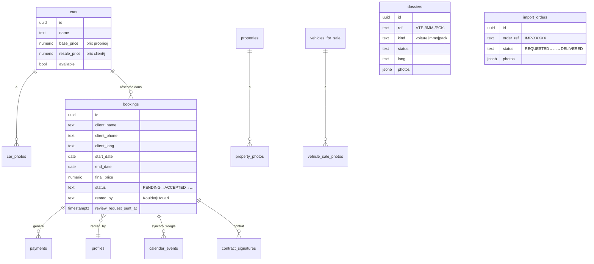

# 🗄️ Base de données (Supabase)

Retour : [[🏠 ACCUEIL]] · [[🧩 ECOSYSTEME]]

> [!info] Projet `febrrgqpyqqrewcohomx` — PostgreSQL + Storage + RLS
> Une seule base pour le site ET l'app. Écritures admin/app via **clé service** (contourne la RLS). Écritures publiques (formulaires) via policies RLS ciblées.

## Diagramme relationnel (cœur)

## Tables par domaine

> [!example] Location / flotte
> - **`cars`** — véhicules (name, base_price = prix proprio/jour, resale_price = prix client/jour, available, category…). `image_url` = photo principale.
> - **`car_photos`** — multi-photos (car_id, url, position). position 0 = principale.
> - **`bookings`** — réservations. Statuts PENDING/ACCEPTED/CONFIRMED/ACTIVE/COMPLETED/REJECTED. `rented_by` attribue à Kouider ou Houari. `client_lang` = langue du client (réponses dans sa langue). `review_request_sent_at` = flag machine à avis.
> - **`payments`** / `payment_logs` — paiements.
> - **`calendar_events`** — lien booking ↔ event Google.

> [!example] Conciergerie élargie
> - **`properties`** — biens immo (title, transaction location/vente, price, city, status). `property_photos`.
> - **`vehicles_for_sale`** — voitures à vendre. `vehicle_sale_photos`.
> - **`dossiers`** — suivi achat véhicule / immo / pack (ref VTE-/IMM-/PCK-, kind, status, photos jsonb, lang). SQL `0025`.
> - **`import_orders`** — commandes d'importation (order_ref IMP-, statuts REQUESTED→SEARCHING→…→DELIVERED, photos). SQL `0022`.
> - **`client_leads`** — leads "être rappelé" (immo/vente/pack). SQL `0016` + `0026` (relance).

> [!example] Relation client / réputation / croissance
> - **`reviews`** — avis (client_name, rating, comment, approved, verified). SQL `0019`.
> - **`newsletter_subscribers`** — abonnés (email unique lower, lang, status). SQL `0020` + `0023` (RLS).
> - **`referrals`** — codes parrainage (code, referrer_name, uses…). SQL `0029`.
> - **`client_intelligence`** / `client_deals` / `actor_brain` — scoring, opérations, mémoire client (app).

> [!example] Finance / contenu / app
> - **`cash_entries`** — caisse manuelle (income/expense, category, amount, currency). SQL `0021`.
> - **`quotes`** — historique des devis. SQL `0030`.
> - **`blog_posts`** — articles (title_fr/ar, body_fr/ar, cover_url, published).
> - **`legal_pages`** — CGV/mentions éditables. SQL `0019`.
> - **`conversations`, `learned_rules`, `assistant_profiles`, `dzaryx_observations`** — cerveau Dzaryx (mémoire, règles apprises).

## Migrations SQL (ordre)

| # | Fichier | Apporte |
|---|---|---|
| 0019 | admin_pack | reviews vérifiés, legal_pages, maintenance cars |
| 0020 | newsletter_reminders | newsletter + rappel J-1 |
| 0021 | cash_register | caisse |
| 0022 | import_orders | suivi importation |
| 0023 | newsletter_rls_fix | RLS lecture abonnés |
| 0024 | client_lang | langue du client |
| 0025 | dossiers | suivi achat/immo/pack |
| 0026 | lead_followup | relance leads |
| 0027 | admin_accounts | username, is_super |
| 0028 | review_request | machine à avis (flag) |
| 0029 | referrals | parrainage |
| 0030 | quotes | historique devis |

> [!warning] Règle finance (jamais déroger)
> `Profit = (client_price_per_day − owner_price_per_day) × nb_days`. Jamais de catalogue. Si `owner_price_per_day` NULL → profit = null (jamais inventé). Voir [[GUIDE/Guide Développeur]].
