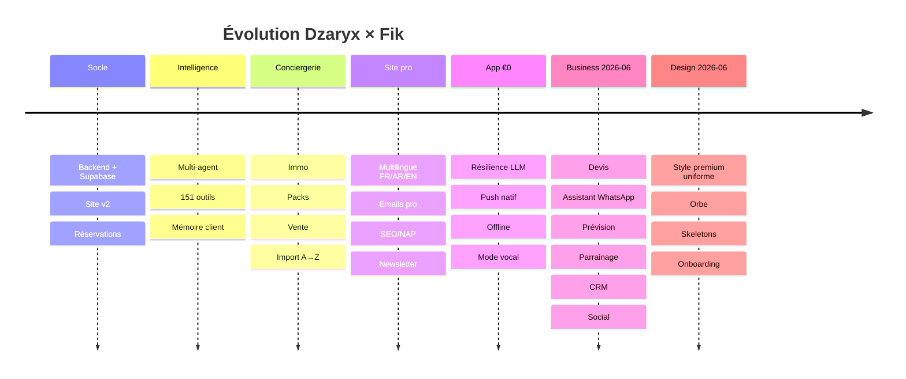
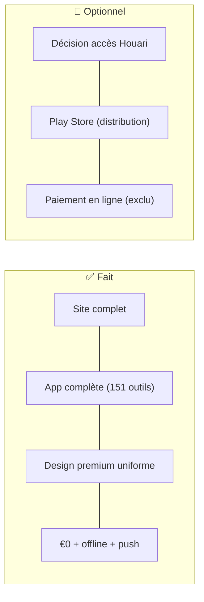

# 🗺️ Roadmap

Retour : [[🏠 ACCUEIL]] · Journal détaillé : [[AUDIT/10_JOURNAL_SESSION]]

## Timeline

## État actuel (2026-06-14)

## ✅ Terminé
- [x] Site : location, vente, immo, packs, import A→Z, leads, suivis, contrats
- [x] Multilingue 100% FR/AR/EN + emails pro + SEO/NAP + cookies
- [x] App : 151 outils, vocal, vision, multi-acteur
- [x] Connexion site↔app (base partagée + proxy + Google Agenda partout)
- [x] Résilience €0 (LLM cascade) + offline + push natif
- [x] Devis (+PDF +historique), Assistant WhatsApp, Caisse, Avis, Newsletter, Blog
- [x] Prévision saison, Relance CRM, Social, Parrainage (+tracking auto), Prix conseillés, Recherche globale
- [x] Design premium uniforme + orbe + skeletons + onboarding
- [x] Sécurité : token GitHub révoqué, clés régénérées

## 🔭 Reste (optionnel)
- [ ] **Houari** : ouvrir certains onglets (Caisse/CA) ? — décision Kouider
- [ ] Distribution **Play Store** (build AAB + clé Google)
- [ ] (Exclu) Paiement en ligne Chargily — virement/acompte suffit

## 🛑 Actions de config en attente
- [ ] SQL déjà lancés : `0028` avis, `0029` parrainage, `0030` devis ✅
- [ ] Rien de bloquant côté sécurité (tout clean)
