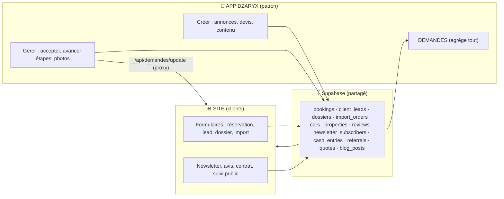
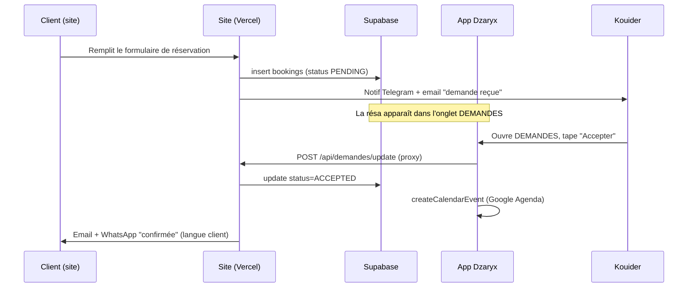

# 🧩 Écosystème — Site ↔ App

Retour : [[🏠 ACCUEIL]] · Voir aussi [[📐 ARCHITECTURE]] · [[🗄️ BASE_DONNEES]]

> [!abstract] L'idée clé
> Le site et l'app **partagent la même base Supabase**. C'est le cœur du système : pas de synchro manuelle, pas de copie. Une donnée écrite d'un côté est lue de l'autre, instantanément.

## Comment les deux se parlent

## Les 3 modes de communication

> [!note] 1. Base partagée (lecture/écriture directe)
> L'app lit `bookings`, `cars`, `properties`… directement via le backend (clé service). CA, Clients, Parc, Agenda = déjà alimentés par le site.

> [!note] 2. Proxy serveur→serveur (écritures qui déclenchent des effets)
> Quand l'app **accepte une réservation** ou **avance un dossier/import**, le backend appelle les **APIs du site** (`/api/update-booking`, `/api/update-dossier`, `/api/update-import-order`). Pourquoi ? Ces APIs déclenchent **email + WhatsApp + Google Agenda** automatiquement. On réutilise la logique du site au lieu de la dupliquer. Pas de CORS car c'est serveur→serveur.

> [!note] 3. Token interne (actions sensibles)
> La newsletter passe par le site (Resend) via un header `x-internal-token` = `INTERNAL_API_TOKEN` (même valeur Railway + Vercel) qui contourne la vérif session admin. Voir [[SITE/02 - Pages & APIs#Newsletter]].

## Parcours type : une réservation

## Qui gère quoi ?

| Donnée | Créée par | Gérée dans l'app ? |
|---|---|---|
| Réservation voiture | Site (client) ou App | ✅ accepter/refuser, agenda |
| Lead (être rappelé) | Site | ✅ relance, conclure |
| Dossier achat/immo/pack | Site ou **App (+ Nouveau)** | ✅ avancer étapes + photos |
| Commande import | Site ou App | ✅ avancer étapes + photos |
| Annonce voiture/immo/vente/pack | **App (chat ou écran)** | ✅ créer/éditer/photos/statut |
| Avis client | Site (post-location) | ✅ publier/masquer/supprimer |
| Abonné newsletter | Site (footer) | ✅ campagne depuis l'app |
| Mouvement caisse | **App** | ✅ |
| Devis | **App** | ✅ + PDF + historique |
| Code parrainage | **App** | ✅ ; utilisé sur les formulaires site |

> [!tip] Règle mentale
> **Le client agit sur le site. Le patron pilote depuis l'app. La base fait le lien.**
